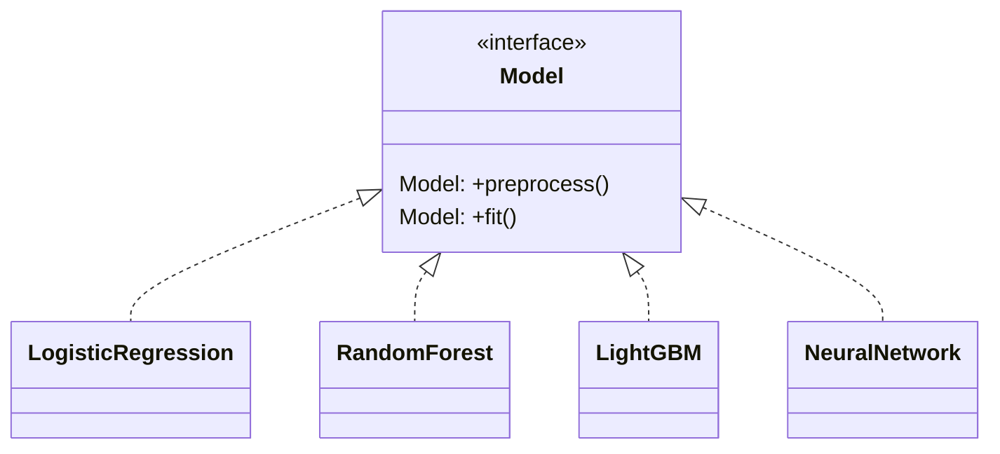
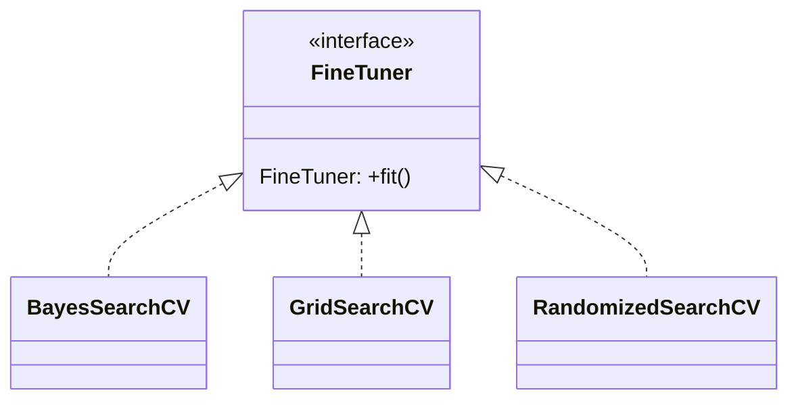
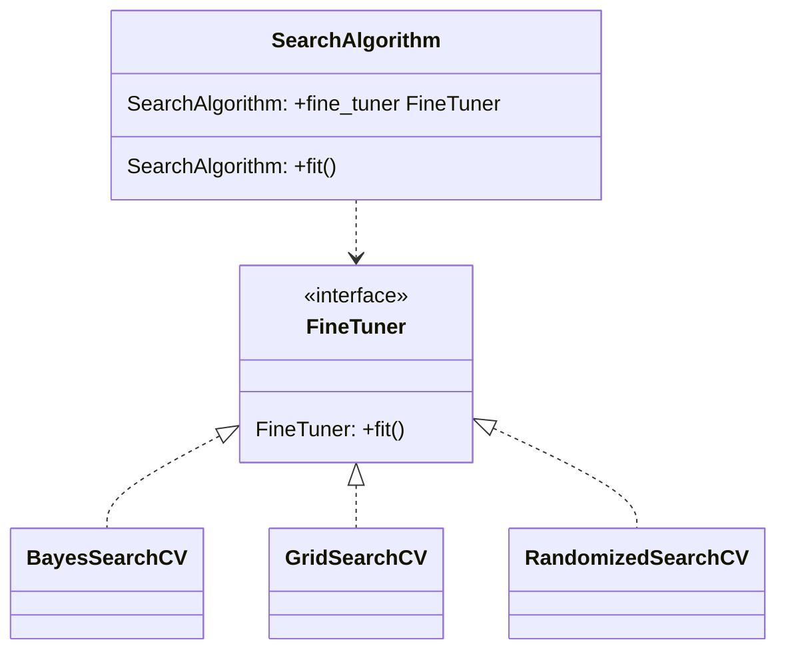
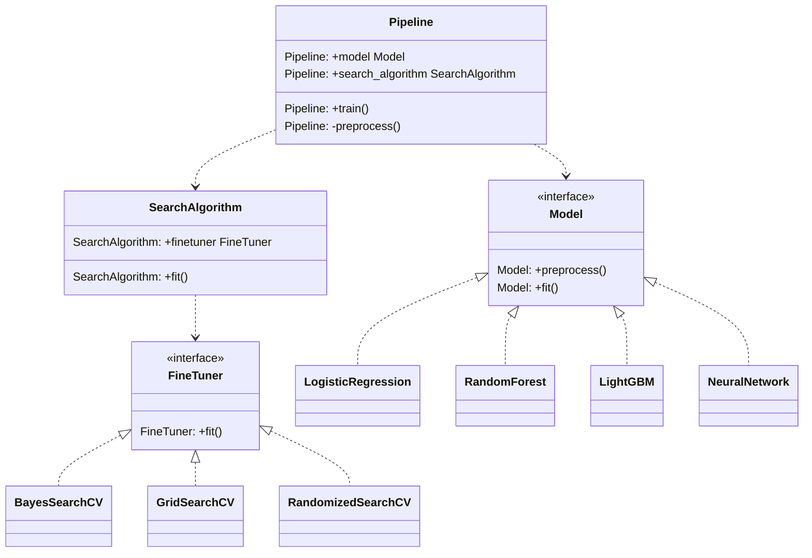
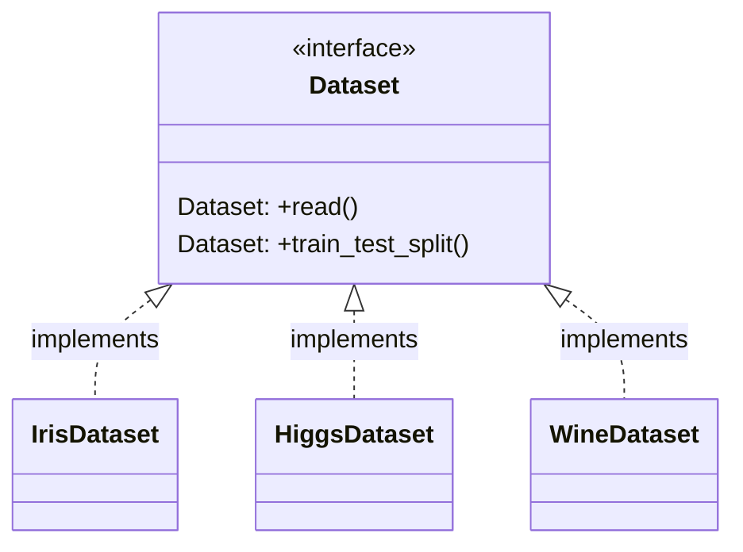
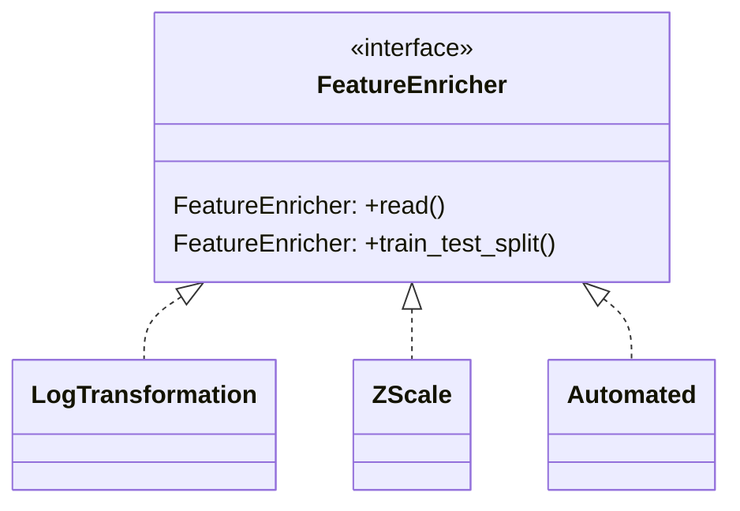
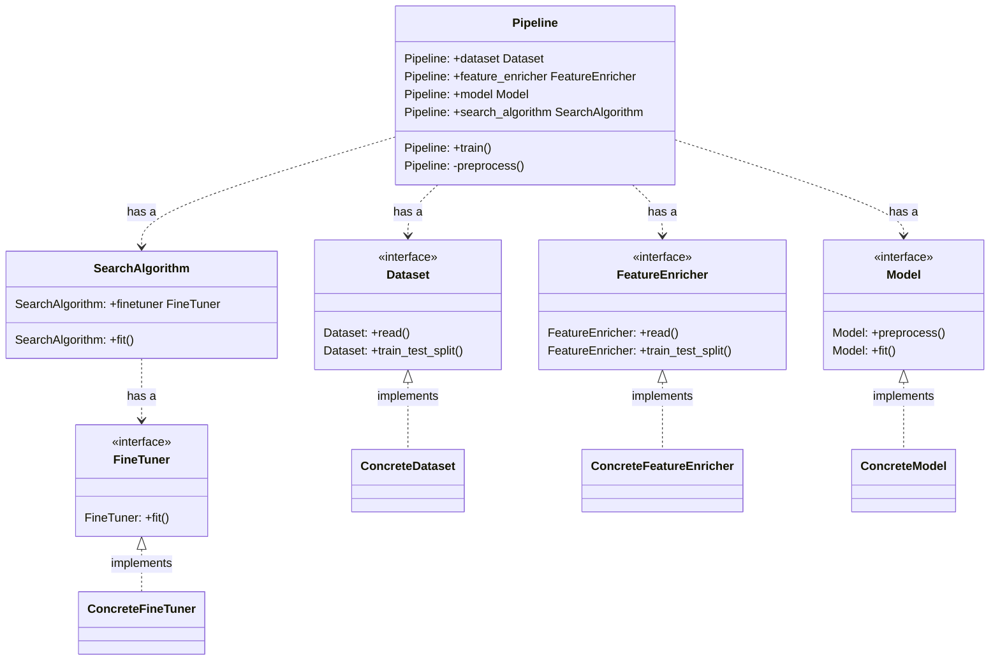

# Speed up Training with MLFlow and Strategy Pattern

## Data

The `Higgs` dataset is a dataset of proton-proton collision events collected at the Large Hadron Collider (`LHC`). The dataset contains information about the properties of the particles produced in the collisions, such as their momentum, energy, and charge. The `Higgs` dataset is used to study the properties of the `Higgs` boson, a fundamental particle that was discovered at the LHC in 2012. The `Higgs` boson is a key component of the Standard Model of particle physics, and its discovery was a major breakthrough in physics.

The `Higgs` dataset is a valuable resource for physicists who are studying the `Higgs` boson and its properties. The dataset  is large and complex, but it can be used to learn a great deal about the `Higgs` boson. The `Higgs` dataset has been used to make important discoveries about the `Higgs` boson, and it will continue to be used to study the `Higgs` boson in the years to come.

Here are some of the key features of the `Higgs` dataset:

- The dataset contains information about the properties of millions of proton-proton collision events.
- The dataset is large and complex, making it difficult to analyze.
- The dataset has been used to make important discoveries about the `Higgs` boson.
- The dataset will continue to be used to study the `Higgs` boson in the years to come.

## MLFlow and Strategy Pattern for Machine Learning Experimentation
This project demonstrates how to use `MLFlow` and the `Strategy pattern` to speed up machine learning experimentation.

### MLFlow
`MLFlow` is an open-source platform for managing the ML lifecycle, including experiment tracking, model packaging, and model serving. `MLFlow` can be used to track the progress of machine learning experiments, store and share models, and deploy models to production.

### Factory Pattern

The `Factory Pattern` is a creational design pattern that provides an interface for creating objects of a superclass or an interface while allowing the subclasses to decide which class to instantiate. It encapsulates the object creation logic, providing a way to create objects without exposing the instantiation logic to the client.

The primary goal of the `Factory Pattern` is to abstract the process of object creation, making it more flexible and easier to manage. It promotes loose coupling between the client code and the concrete classes, allowing for code that is more maintainable and extensible.

The key components of the `Factory Pattern` are:

- `Product`: This refers to the superclass or the interface that defines the common set of methods that the concrete classes must implement.
- `Concrete Products`: These are the specific classes that implement the Product interface. Each concrete product provides a different implementation for the common set of methods.
- `Factory`: This is an interface or an abstract class that declares the factory method for creating objects of the Product type. The factory method returns an instance of the Product.
- `Concrete Factory`: These are the subclasses of the Factory that implement the factory method. Each concrete factory is responsible for creating a specific type of product.

The typical flow of the `Factory Pattern` involves the following steps:

1. The client code requests an object creation by invoking the factory method on the `Factory interface` or abstract class.
2. The concrete `Factory` associated with the requested object type creates an instance of the concrete product.
3. The concrete `Product` is returned to the client code through the factory method, but the client code is unaware of the specific class that was instantiated.

By utilizing the `Factory Pattern`, you can centralize the object creation logic and decouple the client code from the specific implementation classes. This makes it easier to introduce new types of products or modify the existing ones without modifying the client code.

Overall, the `Factory Pattern` provides a flexible and extensible way to create objects, promoting code re-usability, maintainability, and separation of concerns.

The following diagram shows the `Factories` which have been implemented in the current project.

#### Model

The UML diagram is shown below.



#### Fine Tuner

The UML diagram is shown below.



### Strategy Pattern
The `Strategy pattern` is a design pattern that allows you to decouple the algorithm from the context in which it is used. This can be useful for machine learning experimentation, as it allows you to easily experiment with different algorithms without having to modify the code that loads and prepares the data.

Benefits of Using `MLFlow` and the `Strategy Pattern`
There are several benefits to using `MLFlow` and the `Strategy pattern` for machine learning experimentation:

`MLFlow` provides a centralized platform for tracking experiments, storing models, and deploying models. This can help you to keep track of your experiments, share your models with others, and deploy your models to production.

On the other hand, the `Strategy pattern` allows you to easily experiment with different algorithms without having to modify the code that loads and prepares the data. This can save you time and effort when experimenting with different machine learning algorithms.

#### Search Algorithm

The `Search Algorithm` takes the `FineTuner` factory. The UML diagram is shown below.



#### Pipeline

The `Pipeline` takes both `factories`: `FineTuner` & `Model` concrete implementations by composition. The UML diagram is shown below.



### Requirements
To use this project, you will need to have `Python 3.9` or greater, and install the following dependencies.

```bash
pip install -r requirements_dev.txt
```

Once you have installed the necessary dependencies, you can run the following command to start a `MLFlow` server:

```bash
export MLFLOW_PORT=5000 &&
export MLFLOW_ARTIFACT_ROOT=mlruns
export MLFLOW_TRACKING_URI=sqlite:///database/mlruns.db &&
mlflow server --backend-store-uri=$MLFLOW_TRACKING_URI --default-artifact-root=file:$MLFLOW_ARTIFACT_ROOT --host 0.0.0.0 --port $MLFLOW_PORT
```

Modify `config/config.yaml` according to your needs. Then, you can start a training loop as follows:

```bash
python -m src.main [options]
```

The `options` are listed below:

```bash
usage: [-h] [-f FILEPATH] [-d DATASET] [-l LOCATION] [-e EXPERIMENT_NAME]

options:
  -h, --help            show this help message and exit
  -f FILEPATH, --filepath FILEPATH
                        Path to configuration file
  -d DATASET, --dataset DATASET
                        Dataset name
  -l LOCATION, --location LOCATION
                        Folder to store data
  -e EXPERIMENT_NAME, --experiment_name EXPERIMENT_NAME
                        MLFlow's experiment name
```

The project will then load the `Higgs` dataset, train a model, and track the experiment using `MLFlow`. You can then view the results of the experiment in the `MLFlow UI` in your web browser in [localhost](http://0.0.0.0:5000/)

## Conclusion

This project demonstrates how to use `MLFlow`, the `Strategy pattern`, and the `Factory pattern` to speed up machine learning experimentation. `MLFlow` provides a powerful framework for managing experiments, tracking model performance, and sharing models with others. The `Strategy pattern` allows for flexible and interchangeable strategies for fine-tuning machine learning models. Additionally, the `Factory pattern` facilitates the creation of these strategies without exposing the instantiation logic to the client code.

By combining `MLFlow`, the `Strategy pattern`, and the `Factory pattern`, you can effectively manage and optimize your machine learning workflows. `MLFlow` enables easy experiment tracking and model management, while the `Strategy pattern` and the `Factory pattern` provide a structured approach to fine-tuning models and encapsulating object creation logic.

This approach empowers data scientists and machine learning engineers to iterate quickly, compare different strategies, and make informed decisions based on experiment results. Furthermore, the modularity and extensibility offered by the `Strategy pattern` and the `Factory pattern` make it easier to incorporate new fine-tuning strategies or modify existing ones without impacting the overall system.

In summary, leveraging MLFlow, the Strategy pattern, and the Factory pattern can greatly enhance the efficiency and effectiveness of machine learning experimentation, model management, and deployment processes.

## Future work

In order to enhance the existing system, the future work will involve implementing two additional `Factory patterns`: `FeatureEnricher` and `Dataset`. These new patterns will complement the already present `Strategy Pattern`, consisting of the `Pipeline` and `SearchAlgorithm`, which includes the `Model` and `FineTuner` factories, respectively.

### Dataset Factory

The `Dataset` Factory will facilitate the collection of data used for training or evaluating machine learning models. By utilizing the `Dataset` Factory, we can abstract away the creation details and handle the creation of various types of datasets, such as image datasets, text datasets, or audio datasets, with ease. Also, will facilitate switching between datasets such as `Iris`, `Higgs`, `Wine`, between others. The UML diagram is shown below:




### Feature Enricher Factory

Similarly, the `FeatureEnricher` factory will provide a flexible way to processes and enrich the input data with additional features before it is fed into the `Pipeline`. By employing the `FeatureEnricher`, we can encapsulate the creation logic and easily switch between different enricher implementations (such as `LogTransformation`) based on specific requirements or configurations. The UML diagram is shown below:



### Final System

These new factory patterns will seamlessly integrate with the existing `Strategy Pattern`, which already includes the `Pipeline` and `SearchAlgorithm` strategies. The `Pipeline` strategy defines the pipeline of operations to be applied to the training data and subsequent training. On the other hand, the `SearchAlgorithm` encapsulates the algorithmic choices for performing hyperparameter search and optimization of the `Model` at hand.

By incorporating the `FeatureEnricher` and `Dataset` factories alongside the existing `Strategy pattern` and `Factory Pattern`, the system will gain increased `modularity`, `extensibility`, and `maintainability`.

A proposed final product is shown below:


